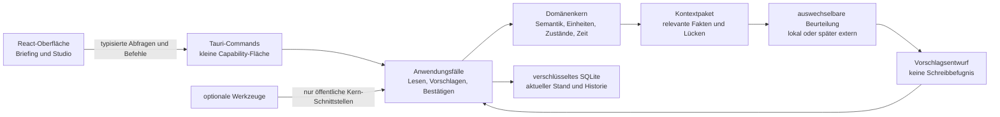

# K4 — Technische Grundlage

Stand: 9. September 2026 · **abgeschlossen**

## Ergebnis in einem Satz

Momentum wird als **lokale Windows-Desktop-App mit Tauri 2, React und TypeScript sowie einem Rust-Anwendungskern** gebaut; persönliche Daten liegen verschlüsselt in einer lokalen SQLite-Datenbank, und weder Oberfläche noch eine spätere KI dürfen diese Daten direkt verändern.

Diese Entscheidung legt die tragende technische Form fest. Sie installiert noch nichts, erzeugt keine App-Dateien und wählt keinen KI-Anbieter.

## Anforderungen, die die Architektur tragen muss

Die Grundlage muss gleichzeitig ermöglichen:

- ein hochwertiges, frei gestaltbares Briefing und ein tieferes Studio;
- wenige stabile Grundbausteine statt fest verdrahteter Lebensbereiche;
- typisierte Eigenschaften, Beziehungen und veränderbare Bedeutungen;
- nachvollziehbare Fakten, Unsicherheiten, Vorschläge und Änderungssätze;
- lokale Nutzung ohne Konto, Cloud oder laufende Internetverbindung;
- vollständigen Export und echte Wiederherstellung;
- optionale Werkzeuge, die den Kern nicht umbauen oder umgehen;
- einen späteren KI-Einsatz ohne direkte Schreibbefugnis und ohne Anbieterbindung.

## Technikauswahl

| Bereich | Entscheidung für Momentum |
| --- | --- |
| Desktop-Rahmen | **Tauri 2**, zunächst Windows 10/11 x64 |
| Oberfläche | **React mit TypeScript**, gebaut mit Vite; eigene visuelle Sprache statt umfangreicher UI-Komponentenbibliothek |
| Anwendungskern | **Rust** mit klar getrennten Domänen-, Anwendungs- und Infrastrukturmodulen |
| Lokale Daten | **SQLite über `rusqlite`**, als gebündelte SQLCipher-Variante für vollständige Datenbankverschlüsselung |
| Schlüssel | zufälliger Datenbankschlüssel, mit Windows **DPAPI für den aktuellen Benutzer** geschützt; niemals im Repository oder Log |
| Verteilung | zunächst **NSIS-Installer pro Benutzer**, ohne Administratorpflicht; kein Auto-Update in Version 1 |
| Netzwerk | standardmäßig vollständig offline; spätere externe Adapter sind einzeln freizugebende Ausnahmen |
| Versionen | beim Start von K5 aktuelle stabile Versionen wählen und in `Cargo.lock` sowie npm-Lockdatei festhalten |

### Warum Tauri ausgewählt ist

Tauri verbindet eine frei gestaltbare Web-Oberfläche mit einem nativen Rust-Kern. Seine Berechtigungen und Capabilities können genau festlegen, welche Befehle ein Fenster aufrufen darf. Auf Windows verwendet Tauri die vorhandene Edge-WebView2-Laufzeit und kann NSIS- oder MSI-Installer erzeugen.

Für Momentum ist das besonders passend: Das Briefing und Studio brauchen gestalterische Freiheit, während Datenzugriff, Berechnungen und spätere Integrationen eine harte Vertrauensgrenze benötigen. Rust bringt die verlässliche Logik in den Kern; React bleibt auf Darstellung und Interaktion konzentriert.

Der Entwicklungsrechner erfüllt die bekannten Voraussetzungen bereits: Node und npm, stabile Rust-/Cargo-Werkzeuge, Visual Studio 2022 mit C++-Werkzeugen sowie WebView2 sind vorhanden. In K4 wurde trotzdem nichts installiert oder erzeugt.

### Abgewogene Alternativen

| Kriterium | Tauri 2 + React | Electron + React | WinUI 3 + C# |
| --- | --- | --- | --- |
| Freie, hochwertige Oberfläche | sehr gut | sehr gut | gut, aber stärker an XAML gebunden |
| Begrenzbarer Zugriff der Oberfläche | explizite Commands und Capabilities | sicher möglich, verlangt konsequente Prozess-/IPC-Härtung | native Prozessgrenze muss selbst strukturiert werden |
| Lokaler, typisierter Kern | Rust passt sehr gut | TypeScript/Node bequem, aber weniger harte Sprachgrenze | C# passt sehr gut |
| Paketgröße und Laufzeit | nutzt WebView2 | bringt Chromium und Node mit | native Windows-Laufzeit |
| Entwicklungsaufwand | zwei Sprachen und native Werkzeugkette | geringster Einstieg | gute Windows-Werkzeuge, langsamere Iteration für den gewünschten freien Arbeitsraum |
| Wechselkosten | Oberfläche weitgehend web-basiert, Kern klar abgetrennt | Oberfläche gut portierbar, Electron-spezifischer Hauptprozess | stärkste Bindung an Windows/XAML |

Electron bleibt eine vertretbare Rückfalloption, falls der Tauri-/Rust-Build in K5 auf diesem Gerät nicht zuverlässig reproduzierbar ist. WinUI 3 wäre für eine stark native Standardoberfläche attraktiv, ist für Momentums experimentelleren Briefing-/Studio-Raum aber nicht die erste Wahl. Ein Rückfall wird nur nach einem dokumentierten technischen Fehlschlag entschieden, nicht wegen der ersten ungewohnten Rust-Aufgabe.

## Vertrauens- und Modulgrenzen



Die Regeln dieser Grenze sind verbindlich:

1. Die React-Oberfläche erhält kein Dateisystem, kein SQL und keine generische Tauri-Shell.
2. Tauri stellt nur fachliche Commands bereit, beispielsweise „Briefing laden“, „Sammlung anlegen“ oder „Änderung bestätigen“ — niemals „beliebiges SQL ausführen“.
3. Der Domänenkern kennt keine React-Komponenten, Fenster oder konkreten KI-Anbieter.
4. Datenzugriff geschieht nur über Repository-Schnittstellen im Rust-Kern.
5. Werkzeuge und Beurteilungsadapter verwenden dieselben Anwendungsfälle; sie umgehen weder Semantik noch Befugnisse.
6. Jede bestätigte Änderung wird als eine Transaktion zusammen mit ihrem nachvollziehbaren Änderungsereignis gespeichert.

### Vorgesehene Ordnergrenzen für K5

Die genaue Dateizahl bleibt K5 überlassen, die Verantwortungen nicht:

```text
src/                         React, TypeScript, Ansichtsmodelle, Gestaltung
src-tauri/src/domain/        reine Typen und Regeln ohne Tauri oder SQLite
src-tauri/src/application/   Abfragen, Commands, Änderungsvertrag, Assistenzablauf
src-tauri/src/infrastructure/SQLite, Export, Uhr, DPAPI und spätere Adapter
src-tauri/src/tools/         optionale Werkzeuge hinter einer gemeinsamen Schnittstelle
src-tauri/src/desktop/       schmale Tauri-Command- und Capability-Grenze
tests/fixtures/              ausschließlich synthetische K1-/K2-Prüffälle
```

## Lokaler flexibler Datenkern

SQLite speichert keinen großen unkontrollierten JSON-Block und auch keine separate Tabelle pro Lebensbereich. Verwendet wird ein **kleiner relationaler Kern mit typisierten flexiblen Eigenschaften**.

Das logische Modell — noch kein fertiges SQL-Schema — enthält:

| Baustein | Aufgabe |
| --- | --- |
| Sammlungsdefinition | Name, Beschreibung und Version einer eigenen Art von Dingen |
| Eigenschaftsdefinition | Name, Typ, Einheit oder Optionen sowie bestätigte assistenzrelevante Bedeutung |
| Gegenstand | stabiler Eintrag wie Vorhaben, Termin oder Stuhl-Kandidat |
| Eigenschaftswert | genau einer der fünf V1-Typen: Text, Zahl mit Einheit, Datum/Zeit, Auswahl oder Beziehung |
| Aussage | angegebene, beobachtete, berechnete oder vermutete Information mit Herkunft und Zeitpunkt |
| Absichtsbezug | bestätigte Verbindung zwischen Information und aktiver persönlicher Absicht |
| Vorschlag | Begründung, Alternative, Unsicherheiten und begrenzter Änderungssatz |
| Änderungsereignis | append-only Nachweis von Bestätigung, Korrektur, Migration und Import |
| Werkzeugstatus | aktiviert, pausiert oder ausgeblendet sowie seine veränderbare Konfiguration |

Wichtige Konsequenzen:

- IDs sind stabile UUIDs und bleiben in Exporten erhalten.
- Eigenschaftstyp, Einheit und Beziehung werden durch Constraints geprüft; ein beliebiges JSON-Feld darf diese Prüfung nicht umgehen.
- Eine Bedeutungsänderung erzeugt eine neue Definition beziehungsweise Version. Alte Werte werden nicht still umgedeutet.
- Aktueller Stand liegt direkt abfragbar in relationalen Tabellen. Das Änderungsprotokoll ergänzt Nachvollziehbarkeit, ist aber kein vollständiges Event-Sourcing-System.
- Planung, Durchführung, Beobachtung und Vermutung bleiben unterschiedliche Aussagen statt eines überladenen Statusfelds.
- K4 führt keine zusätzliche Löschfunktion ein. Sobald eine solche Produktfunktion beauftragt wird, müssen Aufbewahrung und Änderungsprotokoll ausdrücklich so festgelegt werden, dass „löschen“ nicht bloß unsichtbares Verstecken bedeutet.

## Assistenz ohne Blackbox-Schreibzugriff

Der Assistenzablauf besteht aus sechs getrennten Stufen:

1. **Kontext bilden:** Nur relevante Fakten, Herkunft, bestätigte Bedeutung, Lücken und geltende Absichten werden zu einem versionierten Kontextpaket verdichtet.
2. **Verlässlich prüfen:** Zeitüberschneidungen, Einheiten, Zustände, Beziehungen und harte Grenzen werden deterministisch berechnet.
3. **Beurteilen:** Eine austauschbare Komponente darf Möglichkeiten abwägen und Sprache formulieren. Zu Beginn kann das eine lokale deterministische Implementierung sein; ein Modellanbieter ist nicht vorausgesetzt.
4. **Vorschlag validieren:** Referenzen, behauptete Fakten und Änderungssatz werden gegen den geprüften Kontext kontrolliert. Unbekanntes bleibt unbekannt.
5. **Verständlich zeigen:** Das Ansichtsmodell enthält immer „bekannt — Bedeutung — Vorschlag — Wirkung“, außerdem Alternative und Unsicherheit.
6. **Gezielt bestätigen:** Erst Dennis' konkrete Antwort wird in einen fachlichen Command übersetzt und atomar gespeichert. Der Beurteilungsadapter erhält niemals direkten Datenbank- oder Dateizugriff.

### Spätere KI

K4 wählt bewusst **keinen Anbieter und kein Modell**. Stattdessen wird eine schmale `Reasoner`-Schnittstelle festgelegt. Eine spätere lokale oder externe Implementierung erhält nur das minimierte Kontextpaket und liefert einen Vorschlagsentwurf zurück.

Eine externe Implementierung bleibt deaktiviert, bis Datenumfang, Kosten, Anbieter und Einwilligung ausdrücklich entschieden sind. Netzwerkzugriff wird nur in diesem Adapter erlaubt. Prompts, Antworten oder persönliche Inhalte werden standardmäßig nicht protokolliert. Der lokale Kern, Datenzugriff, Export und bestätigte Änderungen funktionieren ohne diesen Dienst.

## Optionale Werkzeuge

Kalender, Diätanalyse und spätere Fachfähigkeiten werden in Version 1 **nicht als Laufzeit-Plugins** oder eigene Mini-Apps gebaut. Ein Werkzeug ist ein internes, typisiertes Modul mit begrenzten Beiträgen:

- Vorlagen für Sammlungen und Eigenschaften;
- fachlich geprüfte Berechnungen;
- zusätzliche Ansichten im Studio;
- Kontextbeiträge für das Briefing;
- eigene Einstellungen und Aktivierungsstatus.

Ein Werkzeug darf weder Tabellen außerhalb der öffentlichen Kern-Schnittstellen verändern noch einen eigenen, widersprüchlichen Datenbestand anlegen. Es kann deaktiviert werden, ohne Grunddaten zu löschen oder den Assistenzkern unbrauchbar zu machen. Ein echter Drittanbieter-Plugin-Marktplatz bleibt außerhalb von Version 1.

## Speicherung, Verschlüsselung und Wiederherstellung

### Speicherort

Die laufenden Daten liegen im von Tauri aufgelösten lokalen Anwendungsdatenordner des aktuellen Windows-Benutzers, nicht im Git-Repository, Installationsordner oder Dokumente-Ordner. Vorgesehen sind getrennte Unterordner für Datenbank, migrationsbedingte Sicherungen, rekonstruierbaren Cache und sparsame technische Logs.

### Datenbankbetrieb

- SQLCipher verschlüsselt Datenbank- und WAL-Seiten mit einem zufälligen Schlüssel.
- Der Schlüssel wird mit Windows DPAPI im Bereich `CurrentUser` geschützt gespeichert.
- `PRAGMA foreign_keys = ON` wird für jede Verbindung ausdrücklich gesetzt.
- WAL und `synchronous = FULL` priorisieren bei der geringen persönlichen Schreiblast Datenhaltbarkeit.
- Alle fachlichen Änderungen und ihr Änderungsereignis laufen in derselben expliziten Transaktion.
- Migrationen sind monoton versioniert, laufen in einer Transaktion und erzeugen vorher über die SQLite-Backup-API eine konsistente Sicherung.

SQLCipher und die dafür gebündelte Kryptobibliothek sind die einzige bewusst zusätzliche native Datenabhängigkeit gegenüber normalem SQLite. Sie ist gerechtfertigt, weil Momentum langfristig persönliche und möglicherweise gesundheitliche Informationen hält und eine spätere Umstellung bereits vorhandener Klartextdaten riskanter wäre.

### Export und Wiederherstellung

Der vollständige V1-Export ist ein versioniertes, dokumentiertes JSON-Format mit Schema-Version, Zeitstempel und stabilen IDs. Er wird nur nach bewusster Dateiauswahl erzeugt und ist zur echten Datenhoheit lesbar, aber deshalb **nicht automatisch verschlüsselt**; die App muss das vor dem Speichern deutlich erklären.

Eine Wiederherstellung wird zuerst vollständig in einen temporären leeren Datenbestand importiert und validiert. Erst danach ersetzt eine Transaktion den aktiven Bestand. Der Abnahmetest exportiert, löscht einen synthetischen Zielbestand und stellt ihn bitweise beziehungsweise semantisch gleichwertig wieder her.

### Ehrliche Schutzgrenze

Die verschlüsselte Datenbank und DPAPI schützen insbesondere eine kopierte Datenbankdatei und Geheimnisse außerhalb des angemeldeten Benutzerkontexts. Sie schützen nicht vor Schadsoftware oder einer Person, die bereits als Dennis in einer entsperrten Windows-Sitzung handelt. Lesbare Exporte müssen von Dennis selbst sicher abgelegt werden. Vor echten persönlichen Daten werden Verschlüsselungs-, Wiederherstellungs- und Logprüfungen Teil der Abnahme.

## Windows-Verteilung und Offline-Verhalten

- Der erste Installer ist NSIS im Modus pro Benutzer und benötigt keine Administratorrechte.
- Version 1 lädt ausschließlich gebündelte UI-Dateien und keine entfernten Webseiten.
- Die App startet, liest, bearbeitet, analysiert, exportiert und stellt Daten ohne Internet wieder her.
- Die vorhandene WebView2-Laufzeit wird genutzt. Der Installer prüft sie verständlich; ein fest gebündeltes WebView2 wird nur ergänzt, wenn der spätere Offline-Installationstest es verlangt.
- Automatische Updates, Hintergrundautostart, Tray-Prozess, Benachrichtigungen und Kalenderkonten gehören nicht automatisch zu Version 1.
- Code-Signierung ist vor einer Verteilung außerhalb von Dennis' eigenem Gerät neu zu entscheiden; sie ist für den lokalen Entwicklungsnachweis kein Grund, jetzt ein Zertifikat zu kaufen.

## Erweiterungs- und Wechselgrenzen

Bewusst stabil sind Domänentypen, Anwendungsfälle, Kontextpaket, Vorschlag/Änderungsvertrag, Repository-Schnittstellen und Exportformat. Austauschbar bleiben:

- React-Komponenten und konkrete Navigation;
- SQLite-Zugriffsschicht, solange Repository-Verträge und Export erhalten bleiben;
- lokale oder externe Beurteilungsadapter;
- einzelne optionale Werkzeuge;
- Tauri-Desktophülle, falls ein belegter technischer Grund einen Wechsel erzwingt.

Nicht vorgesehen ist, beliebigen fremden Code zur Laufzeit zu laden. Anpassbarkeit entsteht aus Daten, Vorlagen, Beziehungen, Sichten und begrenzten Werkzeugen — nicht aus einer ungeprüften Plugin-API.

## Architekturprüfungen für K5

K5 muss die Grundlage früh mit synthetischen Daten beweisen:

1. Tauri-App startet auf Dennis' Windows-Gerät ohne Netzwerk.
2. React kann nur dokumentierte Tauri-Commands verwenden; direkte Dateisystem-, SQL- und Shell-Zugriffe fehlen.
3. Verschlüsselte Datenbank ist außerhalb der App nicht als SQLite-Klartext lesbar; DPAPI-Schlüssel liegt nicht im Klartext vor.
4. Eine Migration, eine fehlgeschlagene Transaktion und ein Neustart beschädigen den synthetischen Bestand nicht.
5. Der K1-Freiheitsfall speichert die fünf Typen, Beziehung und bestätigte Bedeutung ohne Sondertabelle „Stuhl“.
6. Ein Vorschlag kann keine Änderung ausführen; erst bestätigte Commands verändern Daten und erzeugen Historie.
7. Vollständiger JSON-Export und Wiederherstellung in einen leeren Zustand bestehen einen Rundlauf.
8. Ein deaktiviertes Beispielwerkzeug verändert weder Briefing noch Kerndaten.
9. K2-Kontrastfälle bleiben als automatisierbare Domänen- und Vertragstests erhalten.
10. Ein NSIS-Paket startet auf dem Zielgerät und die Kernfunktionen bleiben ohne optionale Dienste nutzbar.

Diese Prüfungen belegen technische Tragfähigkeit, nicht automatisch Assistenzqualität oder persönliches Bediengefühl.

## Quellen und Stand

Die Auswahl wurde am 9. September 2026 gegen aktuelle Primärquellen geprüft:

- [Tauri: Windows-Voraussetzungen](https://v2.tauri.app/start/prerequisites/), [Permissions](https://v2.tauri.app/security/permissions/) und [Windows-Installer](https://v2.tauri.app/distribute/windows-installer/)
- [React: Komponenten](https://react.dev/learn/your-first-component) und [State-Struktur](https://react.dev/learn/managing-state)
- SQLite: [Transaktionen](https://www.sqlite.org/lang_transaction.html), [WAL](https://www.sqlite.org/wal.html), [Foreign Keys](https://www.sqlite.org/foreignkeys.html) und [Backup API](https://www.sqlite.org/backup.html)
- [SQLCipher-Sicherheitsdesign](https://www.zetetic.net/sqlcipher/design/) und [`rusqlite`-Buildoptionen](https://github.com/rusqlite/rusqlite)
- Microsoft: [DPAPI `CryptProtectData`](https://learn.microsoft.com/en-us/windows/win32/api/dpapi/nf-dpapi-cryptprotectdata) und [lokale Anwendungsdaten](https://learn.microsoft.com/en-us/windows/apps/develop/data/store-and-retrieve-app-data)
- Vergleichsgrundlagen: [Electron-Sicherheit](https://www.electronjs.org/docs/latest/tutorial/security), [Electron-Verteilung](https://www.electronjs.org/docs/latest/tutorial/distribution-overview) und [Windows App SDK](https://learn.microsoft.com/en-us/windows/apps/windows-app-sdk/)

## Abschluss und Grenze

K4 entscheidet Technik, Schichten, Datenspeicherung, Schutz, Erweiterungsmodell und Verteilung. Nicht entschieden sind ein KI-Anbieter, echte Kontenanbindungen, zusätzliche Fachwerkzeuge oder eine endgültige Bildschirmgestaltung. Es wurde keine App gebaut.

Der nächste mögliche Abschnitt ist K5. Er beginnt nur nach einem ausdrücklichen Auftrag und setzt den kleinsten vollständigen vertikalen Kern um, statt zuerst einen breiten Tracker-Unterbau zu bauen.
