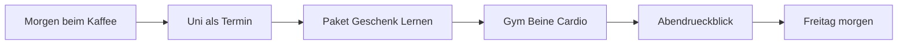

# Nutzungskonzept

Stand: 8. September 2026 · Schritt 1, Überarbeitung · **Vorschlag zur Prüfung, kein Beschluss**

Dieses Dokument beschreibt, wie Dennis die App im Alltag nutzen würde. Grundlage ist die Arbeitsnotiz. Der ausgedachte Donnerstag ist ein wichtiges Nutzungserlebnis, nicht die gesamte App. Es ist kein Pflichtenheft, keine Navigation und keine Technikwahl.

Eine Zusammenführung in Git (etwa PR #1 auf `main`) ist keine Zustimmung zu jeder Formulierung hier.

Alle Tagesbeispiele sind synthetisch. Paket, Geburtstag, Testat, Uni-Zeiten und Training wurden nicht aus echten Konten übernommen. Eine bestimmte Kalenderanbindung folgt daraus nicht.

## Leseschlüssel

- **Nutzeranforderung / Fakt:** von Dennis beschrieben.
- **Beispiel:** der ausgedachte Donnerstag und die Prüfszenarien.
- **Vorschlag:** Assistenzidee, ohne Zustimmung keine Produkteigenschaft.
- **Offen:** noch nicht entschieden.
- **Prüfung nötig:** wissenschaftliche Übertragung auf diese App ist nicht belegt. Keine erfundenen Studien.

## Worum es im Alltag geht

Dennis studiert Wirtschaftsinformatik, steht vor einem anstrengenden Wintersemester und will gleichzeitig Diät/Training, berufliche Entwicklung (Netzwerk, Leute kennenlernen) und alltägliche Verpflichtungen nicht verlieren. Die App soll das nicht nur abhaken. Morgens soll klar sein, was heute zählt. Über Wochen soll erkennbar sein, wie sich ein Ziel entwickelt. Ziele und Bereiche sollen sich ändern lassen, ohne das System neu zu bauen. Abends soll kurzes „Futter“ entstehen, aus dem später nachvollziehbare Rückmeldungen werden.

Nutzung soll sich als investierte Zeit anfühlen: visuell hochwertig, angenehm zu bedienen, mit verständlicher Tiefe und dem Gefühl, dass sich an den eigenen Zielen etwas bewegt. **Geringer Pflegeaufwand allein erfüllt die Vision nicht.**

Das ist kein Satz getrennter Tracker (Studium / Gym / Todos). Ein gemeinsamer Tagesfluss kann mit späterer Detailtiefe und bereichsspezifischen Ansichten zusammenpassen. Welche Ansichten es gibt, ist nicht beschlossen.

## Erlebnisziele

**Nutzeranforderung** (Originalnachrichten 1–4), keine Gestaltungsvorschrift:

- Die Oberfläche soll detailliert, visuell anregend und hochwertig wirken; Benutzen darf Spaß machen.
- Orientierung: man weiß, wo etwas liegt; Tiefe ist erreichbar, ohne im Alltag alles gleichzeitig zu sehen.
- Am Folgetag soll spürbar sein, was getragen hat oder wo bei einem Thema Potenzial liegt — einschließlich erfreulicher Rückmeldung, nicht nur Verwaltung.
- Anpassen von Zielen und Bereichen bleibt intuitiv, ohne dauernde Systempflege.

Dennis hat Motivationssprüche nicht ausgeschlossen. Daraus folgt keine Pflicht zu Gamification, Sprüchen, Animationen oder bestimmten Mitteln. Schutz vor Druck und Schuld ist kein allgemeines Verbot erfreulicher oder motivierender Rückmeldung.

## Verständnishilfe: Arten von Dingen

Keine abschließende Liste und **kein beschlossenes Datenmodell**. Keine Entitäten, Tabellen oder Frameworks. Die Unterscheidung lohnt sich dort, wo ein falscher Typ den Alltag verbiegt.

Wiederholung und Zielbezug sind verschiedene Eigenschaften. Eine einmalige Aufgabe kann zu einem Ziel und seinem Verlauf gehören (Geschenk zum Geburtstag der Mutter).

| Art | Was sie im Alltag ist | Was passiert, wenn man sie falsch behandelt |
| --- | --- | --- |
| **Termin** | Gebundene Zeit, die den Tag begrenzt: Uni an diesem Vormittag. | Als beliebig verschiebbare Aufgabe behandelt, wird der Nachmittag unrealistisch. |
| **Frist** | Zeitpunkt oder Fenster, bis zu dem etwas relevant ist: Paket, Geburtstag am Wochenende, Testat in zehn Tagen. Muss kein Kalendertermin sein. | Mit einem Termin verwechselt, erzwingt die App Uhrzeiten, die niemand kennt. |
| **Einmalige Aufgabe** | Paket abholen, Geschenk besorgen. Keine Wiederholung nötig; Zielbezug trotzdem möglich. | Als Routine eingerichtet, entsteht Verwaltungsarbeit, die Dennis nicht will. |
| **Routine** | Wiederkehrend und flexibel: Gym, Morgenblick, Abendrückblick. | Nur die Wiederkehr geht verloren, wenn man sie ausschließlich als einmaligen Haken führt — nicht automatisch der Zielbezug. |
| **Ziel** | Gewünschtes Ergebnis über den Tag hinaus: Testat bestehen, Diät, Netzwerk. | Mit der heutigen Aktivität verwechselt, zählt bloßes Abhaken als Erfolg. |
| **Geplante Aktivität / Durchführung** | 90 Minuten Lernen *geplant* ist nicht dasselbe wie tatsächlich gelernt. Gym *geplant* ist nicht „stattgefunden“. | Nur den Plan als Wahrheit nehmen erzeugt falsche Verläufe. |
| **Beobachtung** | Was erfasst wurde oder wie es sich anfühlte. Unbekannt bleibt unbekannt. | Als erledigt/nicht erledigt gewertet, entstehen falsche Trends und Druck. |
| **Ergebnis** | Was die Aktivität bewirken sollte: selbst gelöste Aufgaben, ein Gefühl nach dem Training — nicht die Aktivität selbst. | Nur Zeit oder Häkchen als Erfolg behandeln verfehlt den Anspruch an Substanz. |

**Vorschlag:** Einmalige Erledigungen dürfen ohne Routinebaukasten erfasst werden. Ein neues Ziel darf nicht automatisch viele Pflichtfelder und Abendfragen erzeugen.

---

## Der ausgedachte Donnerstag

Synthetisches **Beispiel**. Zeiten (5–10 Minuten morgens, 10–15 Minuten abends) sind Dennis’ gewünschtes Bild, keine vorgeschriebene Mindestdauer. Ein ereignisarmer Abend darf früher fertig sein (**Vorschlag**).

### 1. Morgens, fünf bis zehn Minuten beim Kaffee

**Was Dennis wissen oder entscheiden will:** Was steht heute an und wann? Was ist fällig oder wird bald fällig? Welche kleinen Dinge liegen außerhalb der gewöhnlichen Routinen? Er will nicht das System einrichten. Er will den Tag erkennen.

**Vorhanden / fehlt:**

- Vorhanden im Beispiel: Uni vor dem Mittag, danach Lernwunsch 90 Minuten, abends Gym (Beine und Cardio), Paket von der Post, Geschenk für Mama (Geburtstag am Wochenende), Mathe-Testat in zehn Tagen, zuletzt wenig Mathe.
- Fehlt: echte Uhrzeiten der Uni, Wege, Öffnungszeiten, ob das Paket eine harte Frist hat, Kenntnisstand in Mathe, ob der Nachmittag nach Uni, Heimweg und Essen noch 90 Minuten plus Stadtgang trägt.

**Kleinste hilfreiche Eingabe:** nichts, wenn der Plan von gestern Abend noch gilt. Nur wenn etwas neu ist: ein kurzer Satz oder eine Korrektur, z. B. dass das Geschenk heute in der Stadt erledigt werden soll. Die Eingabe speist die heutige Übersicht und später die Frage, was offen blieb.

**Bei Dennis / Vorschlag der App:**

- Bei Dennis: ob er den Tag so akzeptiert; ob Lernen wirklich nach der Uni stattfindet; ob Stadtgang vor oder nach dem Lernen kommt.
- Die App **kann vorschlagen** (**Vorschlag**, Vollmacht offen): Mathe in den Lernblock, weil Testat in zehn Tagen und zuletzt andere Fächer; sichtbar machen, dass Paket und Geschenk denselben Nachmittag belasten; nicht Uni und Lernen lückenlos aneinanderkleben.

Heimweg, Essen und Pause gehören in ein realistisches Bild (**Vorschlag**). Öffnungszeiten und Wegezeiten sind unbekannt und dürfen nicht erfunden werden.

### 2. Einmalige Erledigungen: Paket und Geschenk

**Was Dennis wissen oder entscheiden will:** Beide Dinge haben heute einen Platz, ohne dass er eine Routine „Paketabholung“ anlegt. Er will sie später erledigen, verschieben oder als offen stehen lassen können.

**Vorhanden / fehlt:** Absicht „heute, Stadt, Geschenk, Geburtstag am Wochenende“ und „Paket von der Post“. Es fehlen Ort, Frist des Pakets, Öffnungszeiten, ob beides in einem Weg zusammenpasst.

**Kleinste hilfreiche Eingabe:** „Donnerstag Geschenk für Mama besorgen, Geburtstag am Wochenende“ — erkannte Angaben müssen sichtbar und korrigierbar sein. Freitexterkennung ist eine **Idee**, keine festgelegte Bedienform.

**Bei Dennis / Vorschlag der App:**

- Bei Dennis: ob er heute wirklich in die Stadt geht; ob das Paket warten kann.
- Die App **kann vorschlagen** (**Vorschlag**): beide Erledigungen als einen Weg, **wenn** passende Orte und Zeiten bekannt wären. Ohne diese Daten keinen erfundenen Sammelweg. Am Abend nur das als offen führen, was unerledigt ist.

### 3. Lernblock nach der Uni

**Was Dennis wissen oder entscheiden will:** Es gibt einen Lernblock mit Zweck, nicht nur „90 Minuten irgendwas“. Er will verstehen, warum heute Mathe dasteht, und das ohne Reibung ändern können.

**Vorhanden / fehlt:** Wunsch „90 Minuten nach der Uni gegen 13 Uhr“, Testat in zehn Tagen, zuletzt andere Fächer, deshalb im Beispiel Mathe. Es fehlen: welche Testat-Themen, was er schon kann, ob 13 Uhr nach Uni realistisch ist.

**Kleinste hilfreiche Eingabe:** Bestätigung oder Korrektur des Fachs bzw. des Zwecks. „Heute Lerngruppe für Datenbanken“ ist neue Information, keine bloße Ablehnung (**Vorschlag**).

**Bei Dennis / Vorschlag der App:**

- Bei Dennis: ob er den Block hält, kürzt, verschiebt; welches Fach gilt, sobald er es ändert.
- Die App **kann vorschlagen** (**Vorschlag**, **Offen** wie weit): Fach und Fokus innerhalb eines von Dennis gesetzten Blocks. Beispiel: Testat nah, Stand unklar → erst Aufgaben ohne Unterlagen, dann Lücken. Dasselbe Ausgangsbild darf bei anderem Kontext anders ausfallen:
  - Mathe sitzt schon → anderes Fach kann Vorrang haben.
  - Stand unbekannt → kurze Klärung vor langem Pauken.
  - Eine Grundlage fehlt → diese zuerst.
  - Morgen eine dringendere Prüfung → Mathe später.

Das sind Veranschaulichungen, keine Entscheidungstabelle für Code. Variierende Sprüche für dieselbe feste Reaktion erfüllen den Anspruch nicht (**Nutzeranforderung**).

**Prüfung nötig:** Aktives Abrufen und verteiltes Üben sind in der Lernforschung gut bewertet (Arbeitsnotiz, Q2). Dass *diese* App durch solche Vorschläge besser lernen lässt, ist nicht belegt. Ein Wiederholungsalgorithmus wurde nicht gewählt.

### 4. Training: Gym, Beine, Cardio

**Was Dennis wissen oder entscheiden will:** Abends steht Training an. Es ist Teil des Tages, nicht ein separates Fitness-Silo. Diät ist ein wichtiges persönliches Ziel. Welche Hilfe und welche Angaben dazu sinnvoll sind, ist offen — nicht vorab auf „täglich Ernährung erfassen“ oder „nur den Gym-Block planen“ festgelegt.

**Vorhanden / fehlt:** Absicht Gym mit Beinen und Cardio. Es fehlen Dauer, Ort, ob es eine feste Wiederkehr mit Wochentagen ist, und welche weiteren Diät-Informationen Dennis beitragen möchte.

**Kleinste hilfreiche Eingabe:** Am Abend, ob es stattgefunden hat, entfallen ist oder verschoben wurde — sonst bleibt es **unbekannt**, nicht heimlich „nicht erledigt“.

**Bei Dennis / Vorschlag der App:**

- Bei Dennis: ob Training heute gilt, wenn der Nachmittag aus dem Ruder läuft.
- Die App **kann vorschlagen** (**Vorschlag**): Training nicht stillschweigend streichen, nur weil Lernen länger dauerte; Zielkonflikt sichtbar machen. Keine medizinische Diätberatung.

### 5. Abends, zehn bis fünfzehn Minuten Rückblick

**Was Dennis wissen oder entscheiden will:** Kurz reflektieren und das liefern, womit die App später arbeiten kann. Es soll sich nicht nach Arbeit anfühlen. Er will nicht den Tag noch einmal komplett eingeben.

**Vorhanden / fehlt:** Der Plan und alles, was schon erfasst wurde. Es fehlen typischerweise: was im Lernblock wirklich passiert ist, ob Paket und Geschenk erledigt sind, warum etwas anders lief.

**Kleinste hilfreiche Eingabe:** nur zu offenen, nützlichen Punkten. Beispiele: Geschenk gekauft, Paket nicht; Grundlagen gingen, Transferaufgaben kaum; direkt nach der Uni erst Luft brauchen. Freitext darf gespeichert werden, ohne sofort als geprüfte Tatsache zu gelten (**Vorschlag**).

**Bei Dennis / Vorschlag der App:**

- Bei Dennis: Deutung (war es Überplanung, ein unerwartetes Ereignis, ein schwieriger Einstieg); ob er den Rückblick heute macht.
- Die App **kann** fehlende Stellen gezielt fragen und bereits Bekanntes übernehmen. Fehlend = unbekannt.
- **Nutzeranforderung aus der Korrektur vom 8.9.2026:** Eine ausgelassene Reflexion löscht keine vorhandenen Informationen und beweist keine unterlassene Aktivität.
- **Vorschlag, kein Verbot:** Den ganzen Tag nicht auf eine Note zu reduzieren. Ein guter Tag darf sich gut anfühlen (Original 4: „gestern war geil“). Das ist kein Auftrag zu Sprüchen oder Gamification.

**Prüfung nötig:** Fortschrittskontrolle kann im Durchschnitt helfen, Ziele zu erreichen (Arbeitsnotiz, Q1). Das rechtfertigt nicht möglichst viel Tracking. Ob der Abendrückblick *für Dennis* nützt, zeigt erst der Betrieb.

### 6. Freitagmorgen: Orientierung am Folgetag

**Was Dennis wissen oder entscheiden will:** Was getragen hat, wo bei einem Thema etwas offen ist, was heute ansteht. Das darf sich auch gut anfühlen, nicht nur wie eine Motivationsleiste oder wie Verwaltung.

**Vorhanden / fehlt:** Der jeweils **erforderliche** Kontext, nicht automatisch die gesamte Historie und nicht nur das, was Donnerstagabend gespeichert wurde. Relevant können sein: frühere Beobachtungen, schon tagsüber erfasste Angaben, aktuelle Ziele, künftige Termine und Fristen. Was nie erfasst wurde, bleibt unbekannt — kein stilles „nicht gemacht“, kein erfundener Trend.

**Kleinste hilfreiche Eingabe:** oft keine. Eine Korrektur, wenn etwas falsch verstanden wurde.

**Bei Dennis / Vorschlag der App:**

- Bei Dennis: ob er einen vorgeschlagenen Fokus für Freitag übernimmt.
- Die App **kann vorschlagen** (**Vorschlag**): Paket bleibt offen und sichtbar, wenn eine Frist bekannt ist; nächster Lernfokus an einer vorhandenen Rückmeldung zu Transferaufgaben; Pause nach der Uni in künftigen Plänen berücksichtigen, ohne das zur starren Regel zu machen.

#### Kleiner hypothetischer Verlauf (Beispiel, keine Regel)

Unterscheidung nach der Arbeitsnotiz:

1. **Nutzerangabe:** Dennis sagt, nachmittags lerne er am liebsten.
2. **Beobachtung:** In den vorhandenen Einträgen werden nachmittags geplante Lernblöcke häufiger begonnen als am Morgen.
3. **Hypothese:** Der Nachmittag könnte für anspruchsvollere Mathe-Aufgaben geeignet sein — das ist eine Vermutung, keine Ursache.
4. **Möglicher Versuch:** Für einige vergleichbare Einheiten den schwierigen Teil nachmittags legen und später prüfen, ob Start und Ergebnis tragfähiger wirken.
5. **Überprüfung:** Reichen die Daten nicht, bleibt die Hypothese unsicher. Eine Korrektur („die Woche hatte ich vormittags keine Uni“) oder eine Zieländerung (anderes Fach hat Vorrang) stellt die Annahme infrage. Vergangenheit wird nicht umgeschrieben.

Das ist keine Wenn-dann-Tabelle und keine KI-Architektur.

**Start ohne umfangreiche Daten:** Heute und demnächst zeigen, Unbekanntes als unbekannt lassen, keine Trends erfinden. Ein einzelner Donnerstag begründet keine „Entwicklung“. Vorschläge bleiben vorsichtig und mit sichtbarer Unsicherheit, bis genug vergleichbare Angaben da sind.

---

## Prüfszenario A — überlasteter Tag

Kein neues Pflichtfeature. Dient dazu, später zu prüfen, ob das Konzept unter Druck noch Dennis’ Tag ist oder zu einem Schuld-Dashboard wird.

**Beispiel:** Uni zieht sich, das Paket hat heute wirklich Frist, das Geschenk ebenfalls, der Lernblock und das Gym passen nicht mehr hintereinander. Der Abend ist kurz und unvollständig.

Was das Konzept hier leisten müsste:

- Den Zielkonflikt zeigen, statt alles als machbar zu listen.
- Einmalige Fristen nicht wie Routinen behandeln und nicht verschwinden lassen.
- Vorschläge zur Reihenfolge oder zum Streichen **anbieten**, nicht heimlich den Kalender umbauen (**Offen:** Art der Planungsvorschläge).
- Abends wenige Fragen, viel Übernahme, kein Zwang, den ganzen Schaden zu dokumentieren.
- Am nächsten Morgen: was offen ist. Ein schwieriger Tag soll nicht die ganze Nutzung in Strafe verwandeln. Erfreuliche Rückmeldung an anderen Tagen bleibt möglich.

Wenn das Ergebnis sich nach Verwaltung oder nach Druck anfühlt, trägt nicht „noch eine Einstellung“, sondern das Grundkonzept nicht.

## Prüfszenario B — Wiedereinstieg nach einer Woche Pause

Kein neues Pflichtfeature. Dennis muss nicht sieben Tage nachtragen.

**Beispiel:** Eine Woche ohne Abendrückblick, Pläne veraltet, Testat näher, Training unklar, einmalige Aufgaben vielleicht erledigt oder nicht.

Was das Konzept hier leisten müsste:

- Heute wieder brauchbar sein, ohne erst das System zu reparieren.
- Lücken als unbekannt zeigen, nicht als Misserfolg.
- Keine Pflicht, die Pause vollständig zu rekonstruieren.
- Ziele und Routinen dürfen pausiert oder geändert werden; die Historie soll nicht umgeschrieben werden (**Vorschlag**, Speicherung offen).
- Eine einzelne neue Information (z. B. „Testat ist jetzt in drei Tagen“) soll die Lage verändern können, ohne dass belanglose Reste der alten Woche den Plan zufällig kippen.

## Prüfszenario C — Verlauf eines Ziels nach mehreren Wochen

Illustrativ, **kein** Beschluss einer Wochenansicht, eines Analysemoduls oder einer besonderen Navigation.

**Gewünschte Orientierung:** Dennis will verstehen, wie sich z. B. Mathe auf das Testat hin entwickelt hat — und welche Angaben einen erkannten Verlauf überhaupt tragen.

**Relevante Daten:** geplante gegen tatsächlich begonnene Lernblöcke, wenige vergleichbare Übungsbeobachtungen, bekannte Lücken, das Ziel (Testat) und seine Frist. Fehlende Tage bleiben Lücken.

**Sinnvolle mögliche Rückmeldung:** vorsichtig und mit Datengrundlage, etwa: in den vorhandenen vergleichbaren Einheiten stieg der Aufwand, die selbst gelösten Transferaufgaben nicht erkennbar. Das ist keine Diagnose und kein Erfolg der App.

**Geringer Eingabeaufwand:** keine extra Wochenbefragung, wenn der Abendrückblick oder kurze Korrekturen das Nötige schon liefern. Ein Verlauf darf Orientierung sein, ohne sofort eine Handlung zu erzwingen.

## Prüfszenario D — Ziel, Priorität oder Bereich ändern

Illustrativ, **kein** Beschluss eines Einstellungs- oder Plugin-Systems.

**Gewünschte Orientierung:** Dennis ändert z. B. den Testat-Fokus, pausiert einen Trainingsaspekt oder benennt einen Bereich — und arbeitet danach normal weiter.

**Relevante Daten:** das neue Ziel oder die neue Priorität; bisherige Beobachtungen bleiben Historie und werden nicht umgeschrieben.

**Sinnvolle mögliche Rückmeldung:** künftige Vorschläge nutzen die neue Lage; alte Annahmen (z. B. „Nachmittag ist der Mathe-Slot“) werden sichtbar unsicher oder zurückgestellt.

**Geringer Eingabeaufwand:** die Änderung selbst, ohne das Produkt neu zusammenzubauen und ohne einen Stapel neuer Pflichtfelder.

---

## Vorschlag: Grundprinzipien

Alles in diesem Abschnitt ist **Vorschlag**, außer wo ausdrücklich als Nutzeranforderung oder als Korrektur vom 8.9.2026 festgehalten.

1. **Ein gemeinsamer Alltag, nicht drei Tracker.** Studium, Training, Erledigungen und berufliche Vorhaben teilen Zeit. Das legt keine einzelne Navigation fest.
2. **Einmaliges braucht keine Routine.** Paket und Geschenk müssen nicht als Wiederkehr eingerichtet werden. Sie dürfen trotzdem zu einem Ziel gehören.
3. **Unbekannt ist nicht erledigt und nicht gescheitert.** Fehlende Einträge dürfen Mittelwerte und Moral nicht still als Null ziehen. Eine ausgelassene Reflexion löscht nichts und beweist keine unterlassene Aktivität (**Korrektur Dennis, 8.9.2026**).
4. **Jede wiederkehrende Eingabe braucht einen späteren Nutzen.** Sonst ist sie nicht Pflicht.
5. **Empfehlen heißt abwägen, nicht auslösen.** Dieselbe Ausgangslage darf bei anderem relevanten Kontext anders ausgehen. Gründe, Annahmen und Unsicherheit sind sichtbar. Eine Korrektur ist neue Information.
6. **Dynamisch heißt nicht beliebig.** Eine weiterhin sinnvolle Linie darf bleiben. Belanglose Änderungen erzeugen keinen Planwechsel. Verlässliche Rechnung ist erlaubt; verengte Lebensregeln sind es nicht.
7. **Keine erfundene Gesamtpunktzahl.** „Wert auf dem Arbeitsmarkt“ ist kein seriös direkt messbarer Einheitswert. Den ganzen Tag auf eine Schulnote zu reduzieren ist ein **Vorschlag, ihn zu vermeiden** — kein dauerhaftes Verbot jeder erfreulichen Tagesrückmeldung.
8. **Sofort brauchbar, Tiefe auf Nachfrage.** Anpassen dürfen, nicht anpassen müssen. Gute Voreinstellungen gehören zum Produkt.
9. **Bereiche sind die aktuelle Lage, keine fest verdrahtete Architektur.** Studium, Diät/Training, berufliche Entwicklung und Alltag sind Beispiele. Musikproduktion war eine Assistenzidee, keine Kernforderung.

**Prüfung nötig, nicht als Wirkung dieser App behaupten:**

- Fortschrittskontrolle kann Ziele unterstützen; mehr Tracking ist nicht automatisch besser. [Q1]
- Abrufen und verteiltes Üben sind nützliche Lerntechniken; die App-Übertragung ist ungeprüft. [Q2]
- Adaptive Hinweise (JITAI) stammen aus Forschung zu Gesundheitsverhalten; das ist eine Gestaltungsanregung, keine validierte Lösung für Studium und Lebensplanung. [Q3]
- Die Kombination in einer privaten App ist ungetestet. „Auf Dennis abgestimmt“ heißt nicht, aus wenigen Angaben ein psychologisches Profil zu bauen.

---

## Was Schritt 1 bewusst nicht festlegt

- Keine Navigation (auch nicht „Heute / Überblick / Detail“), keine Wochenansicht, kein Analysemodul.
- Keine Screens, keine visuelle Identität, keine iOS-Kopie und keine Pflicht zu bestimmten Motivationsmitteln.
- Keinen Technik-Stack, keinen Speicherort für App-Daten, keine KI-Anbindung.
- Keinen Umfang von Version 1 in Schritt 1; der Vorschlag liegt in [umfang-v1.md](umfang-v1.md).
- Keine Kalender-, Uni- oder Gym-Integration nur weil sie im Beispiel vorkommen.

## Früher Prüfbedarf für Version 1

Die Prompt-Reihe prüft kontextbezogene Unterstützung ausführlich erst in Schritt 12. Das ist **kein** Grund, Annahmen über Datenbedarf und Entscheidungsqualität erst nach großer UI- und Modellierungsarbeit anzusehen.

Der V1-Vorschlag in [umfang-v1.md](umfang-v1.md) macht die wesentlichen Ansprüche und den frühen Machbarkeitscheck (V8) sichtbar. Ein kleiner Umfang darf nicht stillschweigend heißen, nur Aufgaben und Termine zu bauen.

## Maximal fünf Fragen, die das Konzept ändern würden

Bekanntes wird nicht erneut gefragt (persönliche Windows-App für Dennis, 50-Euro-Grenze, keine iOS-Kopie, einmalige Aufgaben ohne Routinezwang, keine erfundene Gesamtpunktzahl für den Arbeitsmarkt). Die Fragen werden hier nicht beantwortet.

1. **Arten von Planungsvorschlägen:** Bei welchen konkreten Änderungen soll die App nur zeigen, bis du zustimmst — und bei welchen darf sie innerhalb eines von dir gesetzten Rahmens schon eintragen? Beispiele: Fach eines Lernblocks, Zusammenlegen von Erledigungen, Verschieben von Training. Keine globale Alles-oder-nichts-Entscheidung; daraus folgt kein Einstellungsapparat.
2. **Diät und Training:** Welche Hilfe brauchst du dabei, und welche Informationen möchtest du sinnvoll beitragen?
3. **Abendrückblick als Gewohnheit:** Wie verbindlich soll der Abendrückblick als tägliche Praxis sein? (Getrennt davon gilt bereits: Auslassen löscht nichts und beweist keine unterlassene Aktivität.)
4. **Termine:** Woher sollen Termine und zeitgebundene Verpflichtungen vorerst kommen, und wie willst du sie pflegen?
5. **Berufliche Entwicklung:** In welcher Form darf Netzwerk / Leute kennenlernen vorkommen — nicht nur als tägliche nächste Schritte und nicht nur als Warten auf einen Anlass?

Antworten darauf gehören vor oder in Schritt 2, soweit sie den Umfang der ersten Version verändern. Der V1-Vorschlag in [umfang-v1.md](umfang-v1.md) ist Arbeitsgrundlage für Schritt 3; die fünf Fragen sind weiterhin unbeantwortet. Bedienkonzepte: [bedienkonzepte.md](bedienkonzepte.md).
