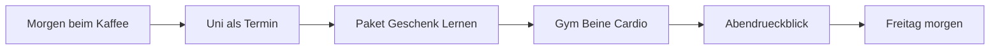

# Nutzungskonzept

Stand: 8. September 2026 · Schritt 1 · **Vorschlag zur Prüfung, kein Beschluss**

Dieses Dokument beschreibt, wie Dennis die App im Alltag nutzen würde. Grundlage ist die Arbeitsnotiz, besonders der ausgedachte Donnerstag. Es ist kein Pflichtenheft, keine Navigation und keine Technikwahl.

Alle Tagesdaten sind synthetisch. Paket, Geburtstag, Testat, Uni-Zeiten und Training wurden nicht aus echten Konten übernommen. Eine Kalenderanbindung folgt daraus nicht.

## Leseschlüssel

- **Nutzeranforderung / Fakt:** von Dennis beschrieben.
- **Beispiel:** der ausgedachte Donnerstag und die Prüfszenarien.
- **Vorschlag:** Assistenzidee, ohne Zustimmung keine Produkteigenschaft.
- **Offen:** noch nicht entschieden.
- **Prüfung nötig:** wissenschaftliche Übertragung auf diese App ist nicht belegt. Keine erfundenen Studien.

## Worum es im Alltag geht

Dennis studiert Wirtschaftsinformatik, steht vor einem anstrengenden Wintersemester und will gleichzeitig Diät/Training, berufliche Entwicklung (Netzwerk, Leute kennenlernen) und alltägliche Verpflichtungen nicht verlieren. Die App soll das nicht nur abhaken. Morgens soll klar sein, was heute zählt. Abends soll kurzes „Futter“ entstehen, aus dem später nachvollziehbare Rückmeldungen werden. Nutzung soll sich als investierte Zeit anfühlen, nicht als zweite Schicht Verwaltung.

Das ist kein Satz getrennter Tracker (Studium / Gym / Todos), sondern ein Tag, in dem dieselben Stunden um dieselben Ziele konkurrieren.

## Fünf Arten von Dingen — nur wo der Unterschied etwas ändert

Nicht jedes Objekt braucht einen eigenen Produktnamen. Die Unterscheidung lohnt sich dort, wo ein falscher Typ den Alltag verbiegt.

| Art | Was sie im Alltag ist | Was passiert, wenn man sie falsch behandelt |
| --- | --- | --- |
| **Termin** | Feste Zeit, die den Tag begrenzt: Uni, Testat-Termin. | Als verschiebbare Aufgabe behandelt, wird der Nachmittag unrealistisch. |
| **Einmalige Aufgabe** | Paket abholen, Geschenk für Mama. Hat oft eine Frist, aber keine Wiederholung. | Als Routine eingerichtet, entsteht genau die Verwaltungsarbeit, die Dennis nicht will. |
| **Routine** | Wiederkehrend und flexibel: Gym, Morgenblick, Abendrückblick. | Als einmalige Aufgabe behandelt, fehlt der Bezug zu Zielen und Verlauf. |
| **Ziel** | Gewünschtes Ergebnis über den Tag hinaus: Testat bestehen, Diät, Netzwerk. | Mit der heutigen Aktivität verwechselt, zählt bloßes Abhaken als Erfolg. |
| **Beobachtung** | Was tatsächlich passiert ist oder wie es sich anfühlte. Unbekannt bleibt unbekannt. | Als erledigt/nicht erledigt gewertet, entstehen falsche Trends und Druck. |

**Vorschlag:** Einmalige Erledigungen dürfen ohne Ziel- oder Routinenmodell erfasst werden. Ein neues Ziel darf nicht automatisch einen Stapel Pflichtfelder und Abendfragen erzeugen.

---

## Der ausgedachte Donnerstag

Synthetisches **Beispiel**. Zeiten (5–10 Minuten morgens, 10–15 Minuten abends) sind Dennis’ gewünschtes Bild, keine vorgeschriebene Mindestdauer. Ein ereignisarmer Abend darf früher fertig sein (**Vorschlag**).

### 1. Morgens, fünf bis zehn Minuten beim Kaffee

**Was Dennis wissen oder entscheiden will:** Was steht heute an und wann? Was ist fällig oder wird bald fällig? Welche kleinen Dinge liegen außerhalb der gewöhnlichen Routinen? Er will nicht das System einrichten. Er will den Tag erkennen.

**Vorhanden / fehlt:**

- Vorhanden im Beispiel: Uni vor dem Mittag, danach Lernwunsch 90 Minuten, abends Gym (Beine und Cardio), Paket von der Post, Geschenk für Mama (Geburtstag am Wochenende), Mathe-Testat in zehn Tagen, zuletzt wenig Mathe.
- Fehlt: echte Uhrzeiten der Uni, Wege, Öffnungszeiten, ob das Paket eine harte Frist hat, Kenntnisstand in Mathe, ob der Nachmittag nach Uni, Heimweg und Essen noch 90 Minuten plus Stadtgang trägt.

**Kleinste hilfreiche Eingabe:** nichts, wenn der Plan von gestern Abend noch gilt. Nur wenn etwas neu ist: ein kurzer Satz oder eine Korrektur, z. B. dass das Geschenk heute in der Stadt erledigt werden soll. Die Eingabe speist die heutige Übersicht und später die Frage, was offen blieb.

**Bei Dennis / Vorschlag der App:**

- Bei Dennis: ob er den Tag so akzeptiert; ob Lernen wirklich nach der Uni stattfindet; ob Stadtgang vor oder nach dem Lernen kommt.
- Die App **kann vorschlagen** (**Vorschlag**, Vollmacht offen): Mathe in den Lernblock, weil Testat in zehn Tagen und zuletzt andere Fächer; sichtbar machen, dass Paket und Geschenk denselben Nachmittag belasten; nicht Uni und Lernen lückenlos aneinanderkleben.

Heimweg, Essen und Pause gehören in ein realistisches Bild (**Vorschlag**). Öffnungszeiten und Wegezeiten sind unbekannt und dürfen nicht erfunden werden.

### 2. Einmalige Erledigungen: Paket und Geschenk

**Was Dennis wissen oder entscheiden will:** Beide Dinge haben heute einen Platz, ohne dass er eine Routine „Paketabholung“ anlegt. Er will sie später erledigen, verschieben oder als offen stehen lassen können.

**Vorhanden / fehlt:** Absicht „heute, Stadt, Geschenk, Geburtstag am Wochenende“ und „Paket von der Post“. Es fehlen Ort, Frist des Pakets, Öffnungszeiten, ob beides in einem Weg zusammenpasst.

**Kleinste hilfreiche Eingabe:** „Donnerstag Geschenk für Mama besorgen, Geburtstag am Wochenende“ — erkannte Angaben müssen sichtbar und korrigierbar sein. Freitexterkennung ist eine **Idee**, keine festgelegte Bedienform.

**Bei Dennis / Vorschlag der App:**

- Bei Dennis: ob er heute wirklich in die Stadt geht; ob das Paket warten kann.
- Die App **kann vorschlagen** (**Vorschlag**): beide Erledigungen als einen Weg, **wenn** passende Orte und Zeiten bekannt wären. Ohne diese Daten keinen erfundenen Sammelweg. Am Abend nur das als offen führen, was unerledigt ist.

### 3. Lernblock nach der Uni

**Was Dennis wissen oder entscheiden will:** Es gibt einen Lernblock mit Zweck, nicht nur „90 Minuten irgendwas“. Er will verstehen, warum heute Mathe dasteht, und das ohne Reibung ändern können.

**Vorhanden / fehlt:** Wunsch „90 Minuten nach der Uni gegen 13 Uhr“, Testat in zehn Tagen, zuletzt andere Fächer, deshalb im Beispiel Mathe. Es fehlen: welche Testat-Themen, was er schon kann, ob 13 Uhr nach Uni realistisch ist.

**Kleinste hilfreiche Eingabe:** Bestätigung oder Korrektur des Fachs bzw. des Zwecks. „Heute Lerngruppe für Datenbanken“ ist neue Information, keine bloße Ablehnung (**Vorschlag**).

**Bei Dennis / Vorschlag der App:**

- Bei Dennis: ob er den Block hält, kürzt, verschiebt; welches Fach gilt, sobald er es ändert.
- Die App **kann vorschlagen** (**Vorschlag**, **Offen** wie weit): Fach und Fokus innerhalb eines von Dennis gesetzten Blocks. Beispiel: Testat nah, Stand unklar → erst Aufgaben ohne Unterlagen, dann Lücken. Dasselbe Ausgangsbild darf bei anderem Kontext anders ausfallen:
  - Mathe sitzt schon → anderes Fach kann Vorrang haben.
  - Stand unbekannt → kurze Klärung vor langem Pauken.
  - Eine Grundlage fehlt → diese zuerst.
  - Morgen eine dringendere Prüfung → Mathe später.

Das sind Veranschaulichungen, keine Entscheidungstabelle für Code. Variierende Sprüche für dieselbe feste Reaktion erfüllen den Anspruch nicht (**Nutzeranforderung**).

**Prüfung nötig:** Aktives Abrufen und verteiltes Üben sind in der Lernforschung gut bewertet (Arbeitsnotiz, Q2). Dass *diese* App durch solche Vorschläge besser lernen lässt, ist nicht belegt. Ein Wiederholungsalgorithmus wurde nicht gewählt.

### 4. Training: Gym, Beine, Cardio

**Was Dennis wissen oder entscheiden will:** Abends steht Training an. Es ist Teil des Tages, nicht ein separates Fitness-Silo. Diät ist ein wichtiges Ziel; im Donnerstag-Beispiel erscheint sie als geplantes Training, nicht als vollständige Ernährungserfassung.

**Vorhanden / fehlt:** Absicht Gym mit Beinen und Cardio. Es fehlen Dauer, Ort, ob es eine feste Routine mit Wochentagen ist, und ob am selben Tag Ernährungsbeobachtungen erwartet werden.

**Kleinste hilfreiche Eingabe:** Am Abend, ob es stattgefunden hat, entfallen ist oder verschoben wurde — sonst bleibt es **unbekannt**, nicht heimlich „nicht erledigt“.

**Bei Dennis / Vorschlag der App:**

- Bei Dennis: ob Training heute gilt, wenn der Nachmittag aus dem Ruder läuft.
- Die App **kann vorschlagen** (**Vorschlag**): Training nicht stillschweigend streichen, nur weil Lernen länger dauerte; Zielkonflikt sichtbar machen. Keine medizinische Diätberatung.

### 5. Abends, zehn bis fünfzehn Minuten Rückblick

**Was Dennis wissen oder entscheiden will:** Kurz reflektieren und das liefern, womit die App später arbeiten kann. Es soll sich nicht nach Arbeit anfühlen. Er will nicht den Tag noch einmal komplett eingeben.

**Vorhanden / fehlt:** Der Plan und alles, was schon erfasst wurde. Es fehlen typischerweise: was im Lernblock wirklich passiert ist, ob Paket und Geschenk erledigt sind, warum etwas anders lief.

**Kleinste hilfreiche Eingabe:** nur zu offenen, nützlichen Punkten. Beispiele: Geschenk gekauft, Paket nicht; Grundlagen gingen, Transferaufgaben kaum; direkt nach der Uni erst Luft brauchen. Freitext darf gespeichert werden, ohne sofort als geprüfte Tatsache zu gelten (**Vorschlag**).

**Bei Dennis / Vorschlag der App:**

- Bei Dennis: Deutung (war es Überplanung, ein unerwartetes Ereignis, ein schwieriger Einstieg); was er weglässt.
- Die App **sollte nicht** den ganzen Tag benoten (**Vorschlag**). Sie **kann** fehlende Stellen gezielt fragen und bereits Bekanntes übernehmen. Fehlend = unbekannt.

**Prüfung nötig:** Fortschrittskontrolle kann im Durchschnitt helfen, Ziele zu erreichen (Arbeitsnotiz, Q1). Das rechtfertigt nicht möglichst viel Tracking. Ob der Abendrückblick *für Dennis* nützt, zeigt erst der Betrieb.

### 6. Freitagmorgen: Orientierung am Folgetag

**Was Dennis wissen oder entscheiden will:** Was gestern trug, wo bei einem Thema etwas offen ist, was heute ansteht. Nicht eine neue Motivationstheke.

**Vorhanden / fehlt:** Nur das, was Donnerstagabend wirklich gespeichert wurde. Was nicht erfasst wurde, bleibt unbekannt — kein stilles „nicht gemacht“, kein erfundener Trend.

**Kleinste hilfreiche Eingabe:** oft keine. Eine Korrektur, wenn die App gestern falsch verstanden hat.

**Bei Dennis / Vorschlag der App:**

- Bei Dennis: ob er einen vorgeschlagenen Fokus für Freitag übernimmt.
- Die App **kann vorschlagen** (**Vorschlag**): Paket bleibt offen und sichtbar, wenn eine Frist bekannt ist; nächster Lernfokus an der Rückmeldung zu Transferaufgaben; Pause nach der Uni in künftigen Plänen berücksichtigen, ohne das zur starren Regel zu machen. Wiederholt kürzere Lernblöcke als geplant: realistischere Länge vorschlagen und später prüfen — nicht `A + B = immer C`.

---

## Prüfszenario A — überlasteter Tag

Kein neues Pflichtfeature. Dient dazu, später zu prüfen, ob das Konzept unter Druck noch Dennis’ Tag ist oder zu einem Schuld-Dashboard wird.

**Beispiel:** Uni zieht sich, das Paket hat heute wirklich Frist, das Geschenk ebenfalls, der Lernblock und das Gym passen nicht mehr hintereinander. Der Abend ist kurz und unvollständig.

Was das Konzept hier leisten müsste:

- Den Zielkonflikt zeigen, statt alles als machbar zu listen.
- Einmalige Fristen nicht wie Routinen behandeln und nicht verschwinden lassen.
- Vorschläge zur Reihenfolge oder zum Streichen **anbieten**, nicht heimlich den Kalender umbauen (**Offen:** Vollmacht).
- Abends wenige Fragen, viel Übernahme, kein Zwang, den ganzen Schaden zu dokumentieren.
- Am nächsten Morgen: was offen ist, ohne Tagesnote und ohne rot gefärbte Strafe.

Wenn das Ergebnis sich nach Verwaltung oder nach Druck anfühlt, trägt nicht „noch eine Einstellung“, sondern das Grundkonzept nicht.

## Prüfszenario B — Wiedereinstieg nach einer Woche Pause

Kein neues Pflichtfeature. Dennis muss nicht sieben Tage nachtragen.

**Beispiel:** Eine Woche ohne Abendrückblick, Pläne veraltet, Testat näher, Training unklar, einmalige Aufgaben vielleicht erledigt oder nicht.

Was das Konzept hier leisten müsste:

- Heute wieder brauchbar sein, ohne erst das System zu reparieren.
- Lücken als unbekannt zeigen, nicht als Misserfolg.
- Keine Pflicht, die Pause vollständig zu rekonstruieren.
- Ziele und Routinen dürfen pausiert oder geändert werden; die Historie soll nicht umgeschrieben werden (**Vorschlag**, Speicherung offen).
- Eine einzelne neue Information (z. B. „Testat ist jetzt in drei Tagen“) soll die Lage verändern können, ohne dass belanglose Reste der alten Woche den Plan zufällig kippen.

---

## Vorschlag: Grundprinzipien

Alles in diesem Abschnitt ist **Vorschlag**, solange Dennis nicht zustimmt.

1. **Ein Tag, nicht drei Tracker.** Studium, Training, Erledigungen und berufliche Vorhaben teilen dieselbe Zeit. Getrennte Module ohne gemeinsamen Tag würden das Donnerstag-Bild verfehlen.
2. **Einmaliges bleibt einmalig.** Paket und Geschenk brauchen keinen Routinebaukasten.
3. **Unbekannt ist nicht erledigt und nicht gescheitert.** Fehlende Einträge dürfen Mittelwerte und Moral nicht still als Null ziehen.
4. **Jede wiederkehrende Eingabe braucht einen späteren Nutzen.** Sonst ist sie nicht Pflicht.
5. **Empfehlen heißt abwägen, nicht auslösen.** Dieselbe Ausgangslage darf bei anderem relevanten Kontext anders ausgehen. Gründe, Annahmen und Unsicherheit sind sichtbar. Eine Korrektur ist neue Information.
6. **Dynamisch heißt nicht beliebig.** Eine weiterhin sinnvolle Linie darf bleiben. Belanglose Änderungen erzeugen keinen Planwechsel. Verlässliche Rechnung ist erlaubt; verengte Lebensregeln sind es nicht.
7. **Kein Lebens-Score.** Keine erfundene Gesamtpunktzahl, kein „Wert auf dem Arbeitsmarkt“ als Kennzahl, keine Tagesnote.
8. **Sofort brauchbar, Tiefe auf Nachfrage.** Anpassen dürfen, nicht anpassen müssen. Gute Voreinstellungen gehören zum Produkt.
9. **Bereiche sind die aktuelle Lage, keine fest verdrahtete Architektur.** Studium, Diät/Training, berufliche Entwicklung und Alltag sind Beispiele. Musikproduktion war eine Assistenzidee, keine Kernforderung.

**Prüfung nötig, nicht als Wirkung dieser App behaupten:**

- Fortschrittskontrolle kann Ziele unterstützen; mehr Tracking ist nicht automatisch besser. [Q1]
- Abrufen und verteiltes Üben sind nützliche Lerntechniken; die App-Übertragung ist ungeprüft. [Q2]
- Adaptive Hinweise (JITAI) stammen aus Forschung zu Gesundheitsverhalten; das ist eine Gestaltungsanregung, keine validierte Lösung für Studium und Lebensplanung. [Q3]
- Die Kombination in einer privaten App ist ungetestet. „Auf Dennis abgestimmt“ heißt nicht, aus wenigen Angaben ein psychologisches Profil zu bauen.

---

## Was Schritt 1 bewusst nicht festlegt

- Keine Navigation (auch nicht „Heute / Überblick / Detail“).
- Keine Screens, keine visuelle Identität, keine iOS-Kopie.
- Keinen Technik-Stack, keinen Speicherort für App-Daten, keine KI-Anbindung.
- Keinen Umfang von Version 1 (Schritt 2).
- Keine Kalender-, Uni- oder Gym-Integration nur weil sie im Beispiel vorkommen.

## Maximal fünf Fragen, die das Konzept ändern würden

Bekanntes wird nicht erneut gefragt (Windows nur für Dennis, 50-Euro-Grenze, keine iOS-Kopie, einmalige Aufgaben ohne Routinezwang, keine Gesamtpunktzahl).

1. **Planungsvollmacht:** Darf die App innerhalb eines von dir gesetzten Blocks (z. B. „90 Minuten lernen“) Fach oder Inhalt selbst eintragen, oder immer nur vorschlagen, bis du zustimmst? Beliebige Kalenderänderungen sind damit nicht gemeint.
2. **Diät im Tagesfluss:** Soll Ernährung im Morgen- und Abendablauf vorkommen, oder im ersten Konzept nur das geplante Training — Diät als Ziel im Hintergrund?
3. **Abendrückblick:** Ist der Rückblick eine erwartete tägliche Routine, die du bewusst auslassen kannst — oder eher optional, ohne jedes Auslassen als Lücke zu führen?
4. **Termine:** Bleiben Uni-Zeiten und ähnliche Termine etwas, das du selbst festhältst, oder gehört eine Kalenderanbindung schon zum Nutzungskonzept (nicht nur zur späteren Technik)?
5. **Berufliche Entwicklung:** Sollen Netzwerk und „Leute kennenlernen“ im Tagesfluss eigene nächste Schritte haben, oder im Alltag hinter Studium, Training und Erledigungen zurücktreten, bis ein konkreter Anlass da ist?

Antworten darauf gehören vor Schritt 2, soweit sie den Umfang der ersten Version verändern.
